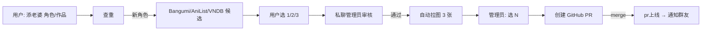

<div align="center">


# astrbot_plugin_animewifex

**AstrBot 群聊二次元老婆插件 · 增强版**

每日抽老婆 · 本命系统 · 图鉴留存 · CP 羁绊 · 群友共建图床

[](LICENSE.txt)
[](https://www.python.org/)
[](https://github.com/Soulter/AstrBot)

</div>

---

## ✨ 玩法亮点

<table>
<tr>
<td width="33%" valign="top">

### 🎲 抽卡留存
- 每日一抽，去重池防重复
- **本命 UP**：自选 3 角，按概率优先出
- **业力系统**：被人重置换会反噬
- 常驻 UP 池 · 单角色 UP · 季节限定

</td>
<td width="33%" valign="top">

### 🤝 社交玩法
- **牛老婆** · **交换** · **换老婆**
- **CP / 羁绊**：累计互动解锁称号
  - 互通有无 · NTR 大魔王 · 相爱相杀
- 业力锁 / 换老婆锁定 / 群级开关

</td>
<td width="33%" valign="top">

### 📚 长期养成
- **图鉴**：个人 · 作品 · 群排行
- **里程碑**：连签 / 图鉴 进度奖励
- **每日任务**：完成 2/3 拿补签券
- **断签保护**：补签券保连签
- **周榜**：周一懒触发自动战报

</td>
</tr>
</table>

> 还有：**要本子**（JM / NH / EH / DL 全平台搜）、**添老婆**（群友提交 → 管理员审核 → 自动建 PR）、AI 翻译缓存与图源策略优化。

---

## 🚀 快速开始

```bash
# 1. 克隆到 AstrBot 插件目录
cd <AstrBot>/data/plugins
git clone https://github.com/Nayukiiii/astrbot_plugin_animewifex_edit.git

# 2. 依赖（AstrBot 通常已自带）
pip install aiohttp Pillow

# 3. 重启 AstrBot，或 dashboard → 插件管理 → 重载

# 4. （可选）配置 GitHub / NVIDIA / Pixiv token 等
#    在 dashboard → 插件配置 中填写
```

新用户**第一次发**「抽老婆」会触发本命引导，选 3 个本命后正式入坑；老用户首次更新到本版本时，会收到一条新功能提示，看一次后自动消失。

---

## 📖 指令速查

### 👤 玩家指令

<details open>
<summary><b>核心抽卡</b></summary>

| 指令 | 说明 |
|---|---|
| `抽老婆` | 抽取今日老婆（新用户触发本命引导） |
| `查老婆 [@用户]` | 查看自己或别人今日老婆 |
| `换老婆` | 放弃今日老婆并重抽 |
| `牛老婆 @用户` | 概率抢走对方今日老婆 |
| `交换老婆 @用户` / `同意交换` / `拒绝交换` / `查看交换请求` | 双方同意互换 |
| `要本子` | 用今日老婆搜 JM / NH / EH / DL |

</details>

<details open>
<summary><b>💖 本命系统</b></summary>

| 指令 | 说明 |
|---|---|
| `设置本命` | 启动 3 选本命引导（10 分钟有效） |
| `本命 关键词` | 引导会话内搜索角色 |
| `跳过` | 跳过当前位 / 直接结束引导 |
| `查看本命` | 当前本命列表 + 换本命冷却 |
| `换本命` | 每月 1 次免费，否则消耗换本命券 |

</details>

<details open>
<summary><b>📚 图鉴 & 排行</b></summary>

| 指令 | 说明 |
|---|---|
| `老婆图鉴` / `我的图鉴` | 个人连续、累计、图鉴进度 |
| `作品图鉴 [作品名]` | 按作品聚合，看缺谁 |
| `今日老婆榜` | 本群今日已抽 + 活跃羁绊称号 |
| `老婆排行` / `连续抽老婆排行` | 连签榜 |
| `图鉴排行` | 群内图鉴 Top |
| `上周战报` | 手动查看上周榜单 |

</details>

<details open>
<summary><b>🎯 留存增强</b></summary>

| 指令 | 说明 |
|---|---|
| `今日任务` | 看今日 3 个任务 |
| `领取任务奖励` | 完成 ≥2 个领补签券 |
| `补签` | 断签时保住连签（消耗 1 张补签券） |
| `我的补签券` | 查看余量 |
| `我的羁绊` | 看与每位群友的 CP 状态 |

</details>

<details open>
<summary><b>🌱 共建图床</b></summary>

| 指令 | 说明 |
|---|---|
| `添老婆 角色名/作品名` | 必须带斜杠；搜索 → 选候选 → AI 中文化后确认提交 |
| `确认` / `改名 X` / `改作品 X` / `取消` | 提交确认会话内（30 秒，超时按 AI 中文名自动提交） |
| `我的老婆申请` | 查看自己的审核进度 |
| `补充来源 作品名` | 给来源未知的提交补作品名 |
| `解析角色 角色名/作品名` | 看翻译档案和图源搜索名 |

</details>

### 🛠 管理员指令

<details>
<summary><b>群内</b></summary>

| 指令 | 说明 |
|---|---|
| `切换ntr开关状态` | 开关本群牛老婆 |
| `重置牛 [@用户]` / `重置换 [@用户]` | 直接重置某人 |
| `刷新缓存` | 批量刷新角色英文/别名缓存 |
| `重译角色 角色名/作品名` | 清单条翻译缓存 |
| `关闭周榜` / `开启周榜` | 本群周榜播报 |
| `重置本命引导` | 让没设本命的群友重新看一次提示 |
| `发券 @用户 补签 N` / `发券 @用户 本命 N` | 手动发补签券 / 换本命券 |
| `查券 @用户` | 看对方补签券、换本命券和称号 |
| `加称号 @用户 称号文字` | 手动颁发称号 |
| `重置任务 [@用户]` | 重置当日任务（不带 @ 默认自己） |
| `清本命 @用户` | 清空本命，对方下次抽老婆重走引导 |

</details>

<details>
<summary><b>私聊审核（添老婆流程）</b></summary>

| 指令 | 说明 |
|---|---|
| `拉取老婆审核` | 查看待审核队列 |
| `通过 <序号>` / `通过 <序号> 作品名` | 通过申请并进入拉图确认 |
| `拒绝 <序号>` | 拒绝申请 |
| `通过 <序号> 作品:X 角色:Y` | 通过并改作品 / 角色（推荐用于中文化） |
| `快速通过 <序号>` | 通过 + 自动用第 1 张图建 PR |
| `选 N <pid>` / `确认 <pid>` | 用第 N 张 / 全部图建 PR |
| `换图 <pid>` | 重新拉一批候选图 |
| `跳过 <pid>` | 创建空 PR，事后手动补图 |
| `pr上线 <序号/pid>` | PR merge 后通知提交者 + 附议者，发换本命券 |

</details>

---

## ⚙️ 配置

完整字段在 `_conf_schema.json`，会自动出现在 dashboard 插件配置页。常用项：

<details open>
<summary><b>基础</b></summary>

| 配置键 | 说明 | 默认 |
|---|---|---|
| `need_prefix` | 是否需要前缀触发 | `false` |
| `image_base_url` / `image_list_url` | 图床基础 URL / list.txt 直链 | — |
| `admin_qq` | 管理员 QQ（用于审核私聊） | — |
| `github_token` / `github_repo` / `github_branch` | 添老婆 PR 用 | — |
| `nvidia_api_key` | AI 翻译角色用 | — |
| `pixiv_refresh_token` / `shuushuu_access_token` | 图源 token，可选 | — |
| `extra_image_sources` | 额外图源，逗号分隔 | — |

</details>

<details open>
<summary><b>玩法平衡</b></summary>

| 配置键 | 说明 | 默认 |
|---|---|---|
| `ntr_max` / `ntr_possibility` | 每日牛次数 / 成功率 | `3` / `0.2` |
| `change_max_per_day` | 每日换老婆次数 | `3` |
| `swap_max_per_day` | 每日交换次数 | `2` |
| `reset_max_uses_per_day` / `reset_success_rate` | 重置次数 / 成功率 | `3` / `0.3` |
| `karma_base_prob` / `karma_max_prob` | 业力概率增量 / 上限 | `0.15` / `0.8` |
| `up_chars` / `up_prob` | 单角色 UP 池 / 概率 | — / `0.1` |
| `up_pool_prob` | 常驻 UP 池概率 | `0.05` |
| `lock_char` | 换老婆锁定角色 | — |
| `reset_char` | 抽到清空去重池的角色 | — |

</details>

<details open>
<summary><b>本命 / 留存（新）</b></summary>

| 配置键 | 说明 | 默认 |
|---|---|---|
| `favorite_prob` | 个人本命 UP 概率 | `0.25` |
| `favorite_change_cooldown_days` | 免费换本命冷却天数 | `30` |
| `streak_freeze_weekly_grant` | 每周一首抽自动赠送补签券数量 | `1` |
| `weekly_settle_enabled` | 周榜默认是否开启 | `true` |
| `season_pool` | 季节卡池 JSON（见下） | — |

`season_pool` 示例：

```json
{
  "name": "2026春日祭",
  "start": "2026-05-01",
  "end": "2026-05-31",
  "chars": ["原神!初音.jpg", "其他作品!某角色.jpg"],
  "rate_up": 0.30
}
```

期间内 `chars` 走限定 UP，期间外**自动从普通池剔除**（保证限定就是限定）。

</details>

---

## 🧩 抽老婆判定顺序

> 越靠前优先级越高。每一层失败才会进入下一层。

```
业力惩罚 → 季节限定 UP → 常驻 UP 池 → 💖 个人本命 UP → 单角色 UP → 普通池（去重）
```

普通池抽取会过滤掉用户的去重池历史；季节卡池期间外的限定角色不会出现在普通池里。

---

## 🏗 架构

```
astrbot_plugin_animewifex/
├── main.py                    # AstrBot 入口、指令注册、事件分发
├── hentai_search.py           # 要本子搜索 + AI 角色解析
├── karma.py                   # 业力 / UP / 锁定规则
├── services/
│   ├── retention.py           # 连签 / 图鉴 / 排行 / 留存提示
│   ├── favorites.py           # 💖 本命系统 + 引导会话
│   ├── engagement.py          # 里程碑 / 补签券 / 任务 / 作品图鉴 / 周榜
│   ├── bonds.py               # CP / 羁绊
│   ├── season.py              # 季节限定卡池
│   ├── translation.py         # 翻译缓存读写
│   ├── character_resolver.py  # Bangumi / AniList / VNDB 候选搜索
│   ├── image_fetcher.py       # Pixiv / e-shuushuu / booru / VNDB / DLsite 拉图
│   ├── github_publisher.py    # GitHub 分支 / 文件 / PR 发布
│   └── review.py              # 审核状态常量
├── tools/
│   └── dry_run_flow.py        # 离线自检脚本
├── _conf_schema.json          # AstrBot dashboard 配置 schema
├── ARCHITECTURE.md            # 拆分规则与后续迁移方向
└── README.md
```

### 数据落地

数据目录：`<AstrBot>/data/astrbot_plugin_animewifex/config/`

| 文件 | 说明 |
|---|---|
| `records.json` | 每日次数、业力、连签、本命、补签券、任务、里程碑、周榜状态、称号 |
| `drawn_pool.json` | 去重池 |
| `bonds.json` | CP / 羁绊数据 |
| `list_cache.txt` | 图床 list.txt 本地缓存 |
| `pending.json` / `add_sessions.json` | 添老婆审核队列 / 会话 |
| `en_cache.json` | 翻译档案 |
| `karma_groups.json` | 分群业力 / UP 配置 |

---

## 📋 添老婆流程



审核状态见 `services/review.py`：`need_source → pending → approved → image_ready → pr_created → online`（或 `rejected`）。

---

## 🖼 图源策略

拉图逻辑在 `services/image_fetcher.py`，策略是**先准、再多**：

1. **Pixiv**（角色+作品名搜索）— 配 `pixiv_refresh_token`
2. **自定义图源** — `extra_image_sources` 扩展
3. **e-shuushuu** — 角色精度高，需 token
4. **Booru 组合标签**（`角色_tag 作品_tag`）— 减少错角色
5. **VNDB** — gal/VN 角色官方图兜底
6. **Booru 纯角色标签** — 组合不够时放宽
7. **Getchu / DLsite** — 作品封面兜底
8. **候选缩略图** — 最后 fallback

这个顺序比"直接纯角色名扫 booru"稳得多，尤其是同名和冷门 gal 角色。

---

## 🧪 本地自检

```bash
python tools/dry_run_flow.py
```

不访问外网，覆盖：翻译缓存、留存统计、审核状态、图源顺序、GitHub 发布、本命引导、里程碑、补签、任务、作品图鉴、周榜、CP 羁绊、季节卡池。

```bash
# 编译检查
python -m py_compile main.py services/*.py karma.py hentai_search.py tools/dry_run_flow.py
```

---

## ⚠️ 注意事项

- 🔒 **不要把 token 写进仓库** — GitHub / Pixiv / NVIDIA 等 API key 都走 dashboard 配置
- 🎯 **添老婆建议带作品名** — 同名角色识别错率会显著降低
- 📂 **list.txt 是抽老婆和图鉴统计的基础** — PR merge 后要同步路径
- 🐳 **Docker 部署**：先备份插件目录，再覆盖代码，清理 `__pycache__`，最后在容器里 `py_compile` 验证

---

## 📄 License

[MIT](LICENSE.txt) © Nayukiiii / monbed
